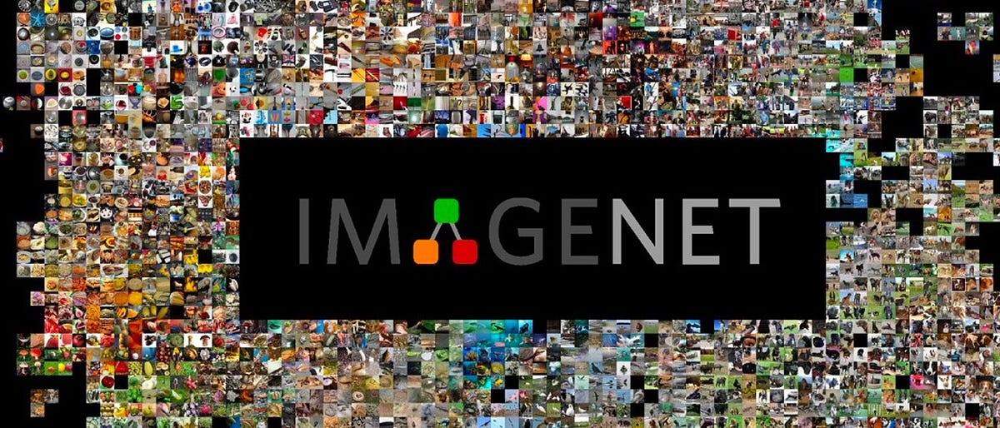

# How to Imagenet

**TL;DR - CLI tool for downloading, extracting, and converting ImageNet ILSVRC2012 to efficient Pytorch dataloaders for training deep learning models**




## Motivation

Despite being one of the de facto large scale image classification datasets, ImageNet (or more specifically the **I**LSVRC2012, the **I**mageNet Large Scale Visual Recognition Challenge 2012) dataset can be challenging to download and even more challenging to efficiently use. This repository is designed as a one stop shop for solving data challenges with the ILSVRC2012 dataset:

- **Download** - We leverage the existing copies in [Academic Torrents](https://academictorrents.com/) to speed up the download process.
- **Unpacking** - Properly unpacks the training and validation datasets. In particular we handle creating the right directory hierarchy from the compressed archives. 
- **Preprocessing** - We preprocess the data from 1 million JPEG images to the efficient MDS format from MosaicML [streaming](https://github.com/mosaicml/streaming) library.

## Usage
```bash
# Install
pip install -r requirements.txt

# Complete pipeline
python imagenet_helper.py download
python imagenet_helper.py untar  
python imagenet_helper.py mds

# Check status
python imagenet_helper.py status
```

## Commands

- `download` - Download via torrents (aria2c), hash verification
- `untar` - Extract tars, sort validation by ground truth
- `mds` - Convert to MDS format (train=shuffled, val=ordered)
- `status` - Show pipeline progress

Use `--only-train`/`--only-val` to only download/untar/mds a specific subset, `-y` to skip prompts.

## Loading the Data

**MDS format (recommended for training):**
```python
from streaming import StreamingDataset
from torchvision import transforms

# Basic usage - images auto-decoded to PIL
dataset = StreamingDataset(local="./data/mds/ILSVRC2012_img_val")
sample = dataset[0]
# sample['x'] is already a PIL Image (auto-decoded from JPEG)
# sample['y'] is class ID (0-999)
# sample['wnid'] is WordNet ID

# Custom dataset with transforms
class ImageNetMDS(StreamingDataset):
    def __init__(self, local=None, remote=None, transform=None):
        super().__init__(local=local, remote=remote)
        self.transform = transform or transforms.ToTensor()
    
    def __getitem__(self, idx):
        sample = super().__getitem__(idx)
        image = sample['x']  # Already PIL Image
        if self.transform:
            image = self.transform(image)
        return image, sample['y']

# Usage with transforms
train_dataset = ImageNetMDS(local="./data/mds/ILSVRC2012_img_train")
remote_dataset = ImageNetMDS(remote="s3://your-bucket/path/to/imagenet/mds")
```

**Standard ImageFolder format:**

If you prefer to use the `torchvision.datasets.ImageFolder`
```python
from torchvision.datasets import ImageFolder
from torchvision.transforms import ToTensor

# Load from extracted directories
train_dataset = ImageFolder("./data/untar/ILSVRC2012_img_train", transform=ToTensor())
val_dataset = ImageFolder("./data/untar/ILSVRC2012_img_val", transform=ToTensor())
```


## Example run


**Download**

```shell
❯ python imagenet_helper.py download --only-val
✅ Disk space check passed. Required: 6GB, Available: 95.7GB

Processing val dataset...

Command to run: aria2c -c --seed-time=0 --file-allocation=falloc --bt-max-peers=256 bt/ILSVRC2012_img_val.tar.torrent -d data/tar
? Download val dataset (~6GB)? Yes
Downloading val dataset using torrent...
Starting download: ILSVRC2012_img_val.tar.torrent

08/11 14:32:11 [NOTICE] Downloading 1 item(s)

08/11 14:32:11 [NOTICE] IPv4 DHT: listening on UDP port 6960

08/11 14:32:11 [NOTICE] IPv4 BitTorrent: listening on TCP port 6916

08/11 14:32:11 [NOTICE] IPv6 BitTorrent: listening on TCP port 6916
 *** Download Progress Summary as of Mon Aug 11 14:33:17 2025 ***
================================================================================================================================
[#c17679 3.3GiB/6.2GiB(52%) CN:15 SD:7 DL:31MiB ETA:1m37s]
FILE: data/tar/ILSVRC2012_img_val.tar
--------------------------------------------------------------------------------------------------------------------------------

[#c17679 6.2GiB/6.2GiB(99%) CN:20 SD:7 DL:79MiB]
08/11 14:33:56 [NOTICE] Seeding is over.
[#c17679 SEED(0.0) CN:12 SD:1]
08/11 14:33:58 [NOTICE] Download complete: data/tar/ILSVRC2012_img_val.tar

08/11 14:33:58 [NOTICE] Your share ratio was 0.0, uploaded/downloaded=0B/6.2GiB

Download Results:
gid   |stat|avg speed  |path/URI
======+====+===========+=======================================================
c17679|OK  |    61MiB/s|data/tar/ILSVRC2012_img_val.tar

Status Legend:
(OK):download completed.
✅ Download completed: ILSVRC2012_img_val.tar.torrent
Verifying hash for ILSVRC2012_img_val.tar...
Hashing: 6.74GB [00:08, 818MB/s]
✅ Hash verification passed: 20199bbecc0a0340
✅ val dataset downloaded and verified successfully
```

**Unpack**

```python
❯ python imagenet_helper.py untar --only-val
✅ Disk space check passed. Required: 6GB, Available: 89.4GB

Processing val dataset...
? Extract val dataset? Yes
Extracting ILSVRC2012_img_val.tar to temporary directory...
Extracting validation archive: 100%|██████████████████████████████████████████████████████| 50000/50000 [00:15<00:00, 3235.63files/s]
Creating 1000 class directories...
Creating directories: 100%|█████████████████████████████████████████████████████████████████████| 1000/1000 [00:02<00:00, 459.32it/s]
📂 Sorting 50000 validation images into class folders...
Sorting images: 100%|███████████████████████████████████████████████████████████████████████| 50000/50000 [00:03<00:00, 16076.61it/s]
Cleaned up temporary raw directory
✅ Validation dataset extracted and sorted to data/untar/ILSVRC2012_img_val
```

**Preprocess**

```shell
❯ python imagenet_helper.py mds --only-val
✅ Disk space check passed. Required: 6GB, Available: 83.1GB

Processing val dataset...
? Convert val dataset to MDS (ordered)? Yes
Discovering class directories and creating class mapping...
Found 1000 classes
Building complete file inventory...
Scanning class directories: 100%|██████████████████████████████████████████████████████████████| 1000/1000 [00:00<00:00, 1304.59it/s]
Found 50000 total images
Preserving original order (no shuffling)
Converting to MDS format...
Processing images: 100%|██████████████████████████████████████████████████████████████████████| 50000/50000 [00:52<00:00, 950.85it/s]
✅ Conversion complete! Output saved to data/mds/ILSVRC2012_img_val

```

## Requirements

- ~500GB total space (150GB (train) and 6GB (val) each for download/extract/mds)
- Python 3.8+, aria2c, tar
